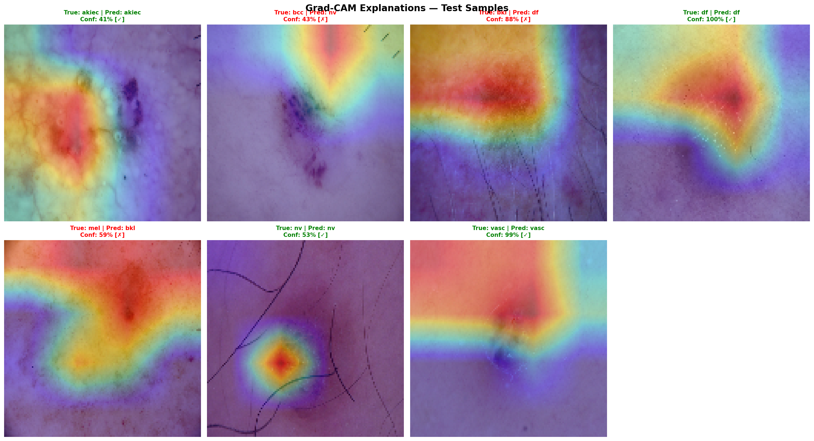
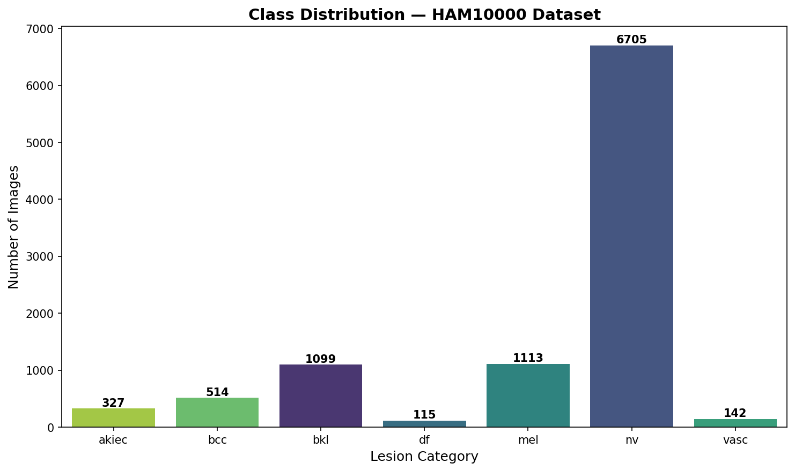
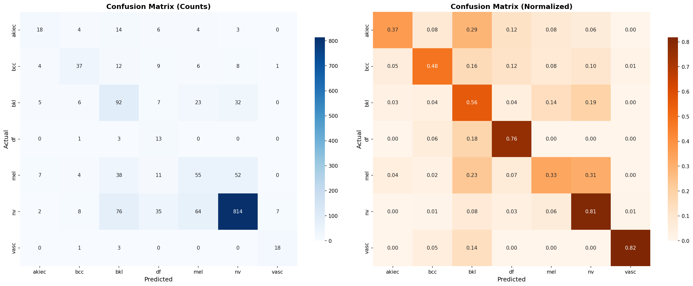
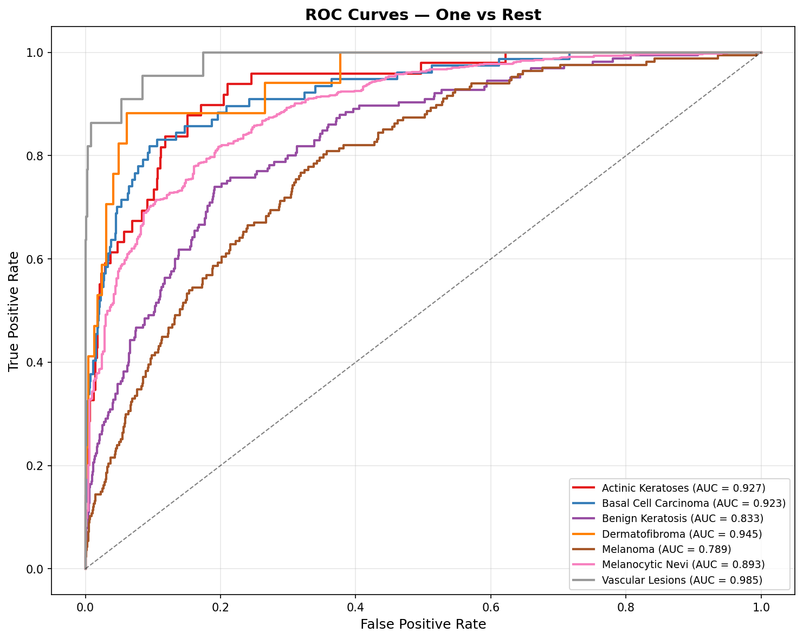

# 🔬 Skin Cancer Classification Using Transfer Learning & Explainable AI


<p align="center">
  
</p>

## 📋 Overview

A deep learning system for **automatic classification** of dermatoscopic images of skin lesions into **7 diagnostic categories**. The project leverages **Transfer Learning** with EfficientNetB3 and incorporates **Explainable AI** (Grad-CAM) to provide visual explanations of model predictions.

> ⚠️ **Disclaimer**: This project is for educational and research purposes only.  
> It is NOT a substitute for professional medical diagnosis.

---

## 🎯 Key Features

- **Transfer Learning** with EfficientNetB3 pre-trained on ImageNet
- **Two-phase training**: Feature extraction → Fine-tuning
- **Class imbalance handling** with computed class weights
- **Grad-CAM visualization** for model explainability
- **Interactive Streamlit app** for real-time predictions
- **Comprehensive evaluation**: Confusion matrix, ROC curves, classification report

---

## 📊 Dataset

**HAM10000** (Human Against Machine with 10,000 training images)

- **Source**: [Harvard Dataverse](https://dataverse.harvard.edu/dataset.xhtml?persistentId=doi:10.7910/DVN/DBW86T) | [Kaggle](https://www.kaggle.com/datasets/kmader/skin-cancer-mnist-ham10000)
- **Size**: 10,015 dermatoscopic images
- **Classes**: 7 diagnostic categories

| Category | Code | Count | Description |
|---|---|---|---|
| Melanocytic Nevi | `nv` | 6,705 | Benign mole |
| Melanoma | `mel` | 1,113 | Malignant skin cancer |
| Benign Keratosis | `bkl` | 1,099 | Seborrheic keratosis |
| Basal Cell Carcinoma | `bcc` | 514 | Common skin cancer |
| Actinic Keratoses | `akiec` | 327 | Pre-cancerous |
| Vascular Lesions | `vasc` | 142 | Blood vessel related |
| Dermatofibroma | `df` | 115 | Benign skin growth |

<p align="center">
  
</p>

---

## 🏗️ Model Architecture

```
Input (224×224×3)
│
▼
┌─────────────────────┐
│   EfficientNetB3    │  ← Pre-trained on ImageNet (frozen → fine-tuned)
│  (Feature Extractor)│
└─────────┬───────────┘
          │
          ▼
   Global Average Pooling 2D
          │
          ▼
    BatchNormalization
          │
          ▼
  Dense(256, ReLU) → Dropout(0.4)
          │
          ▼
  Dense(128, ReLU) → Dropout(0.2)
          │
          ▼
  Dense(7, Softmax) → Output
```

---

## 🚀 Quick Start

### 1. Clone the repository
```bash
git clone https://github.com/TON_USERNAME/skin-cancer-detection.git
cd skin-cancer-detection
```

### 2. Install dependencies
```bash
python -m venv venv
source venv/bin/activate    # Linux/Mac
# venv\Scripts\activate     # Windows
pip install -r requirements.txt
```

### 3. Download the dataset
```bash
# Option A: Kaggle CLI
pip install kaggle
kaggle datasets download -d kmader/skin-cancer-mnist-ham10000
unzip skin-cancer-mnist-ham10000.zip -d data/HAM10000/

# Option B: Manual download from Kaggle and extract to data/HAM10000/
```

### 4. Run the full pipeline
```bash
python main.py --mode all
```

Or step by step:
```bash
python main.py --mode train      # Train the model
python main.py --mode evaluate   # Evaluate on test set
python main.py --mode gradcam    # Generate Grad-CAM visualizations
```

### 5. Launch the interactive app (optional)
```bash
streamlit run app/streamlit_app.py
```

---

## 📁 Project Structure

```
skin-cancer-detection/
│
├── data/
│   └── HAM10000/                   # Dataset (not tracked by git)
│       ├── HAM10000_metadata.csv
│       ├── HAM10000_images_part_1/
│       └── HAM10000_images_part_2/
│
├── notebooks/
│   └── exploration.ipynb           # Data exploration & visualization
│
├── src/
│   ├── __init__.py
│   ├── dataset.py                  # Data loading, preprocessing, augmentation
│   ├── model.py                    # Model architecture & callbacks
│   ├── train.py                    # Training pipeline (2-phase)
│   ├── evaluate.py                 # Evaluation metrics & visualizations
│   └── gradcam.py                  # Grad-CAM explainability
│
├── results/
│   ├── figures/                    # Generated plots & visualizations
│   └── models/                     # Saved models (not tracked by git)
│
├── app/
│   └── streamlit_app.py            # Interactive web demo
│
├── config.py                       # Centralized configuration
├── main.py                         # Main entry point
├── requirements.txt                # Python dependencies
├── .gitignore
├── LICENSE
└── README.md
```

---

## 📈 Results

### Classification Performance

| Metric | Score |
|---|---|
| Accuracy | XX.X% |
| Precision (macro) | XX.X% |
| Recall (macro) | XX.X% |
| F1-score (macro) | XX.X% |
| AUC (macro) | 0.XXX |

### Confusion Matrix
<p align="center">
  
</p>

### ROC Curves
<p align="center">
  
</p>

### Grad-CAM Explanations
<p align="center">
  
</p>

---

## 🧠 Methodology

### 1. Data Preprocessing
- Image resizing to 224×224 pixels
- Pixel normalization to [0, 1]
- Stratified train/validation/test split (70/15/15)
- Data augmentation: random flip, rotation, zoom, contrast, translation

### 2. Training Strategy
- **Phase 1 — Feature Extraction**: Backbone frozen, train classification head only
- **Phase 2 — Fine-tuning**: Unfreeze top layers, train with lower learning rate
- **Class imbalance**: Handled via computed class weights
- **Regularization**: Dropout, BatchNormalization, EarlyStopping

### 3. Explainability
- **Grad-CAM** (Gradient-weighted Class Activation Mapping)
- Highlights discriminative image regions used by the model
- Provides visual evidence for each prediction

---

## 🛠️ Technologies

| Tool | Purpose |
|---|---|
| TensorFlow / Keras | Deep Learning framework |
| EfficientNetB3 | Pre-trained CNN backbone |
| Scikit-learn | Metrics & data splitting |
| Matplotlib / Seaborn | Visualization |
| OpenCV | Image processing |
| Streamlit | Interactive web app |

---

## 📚 References

1. Tschandl, P. et al. *"The HAM10000 dataset"* (2018). Scientific Data.
2. Tan, M. & Le, Q. *"EfficientNet: Rethinking Model Scaling for CNNs"* (2019). ICML.
3. Selvaraju, R.R. et al. *"Grad-CAM: Visual Explanations from Deep Networks"* (2017). ICCV.

---

## 📄 License

This project is licensed under the MIT License — see the [LICENSE](LICENSE) file for details.

---

## 👤 Author

**Ton Nom**

- GitHub: [@ton_username](https://github.com/ton_username)
- LinkedIn: [Ton Profil](https://linkedin.com/in/ton-profil)

---

⭐ If you find this project useful, please give it a star!